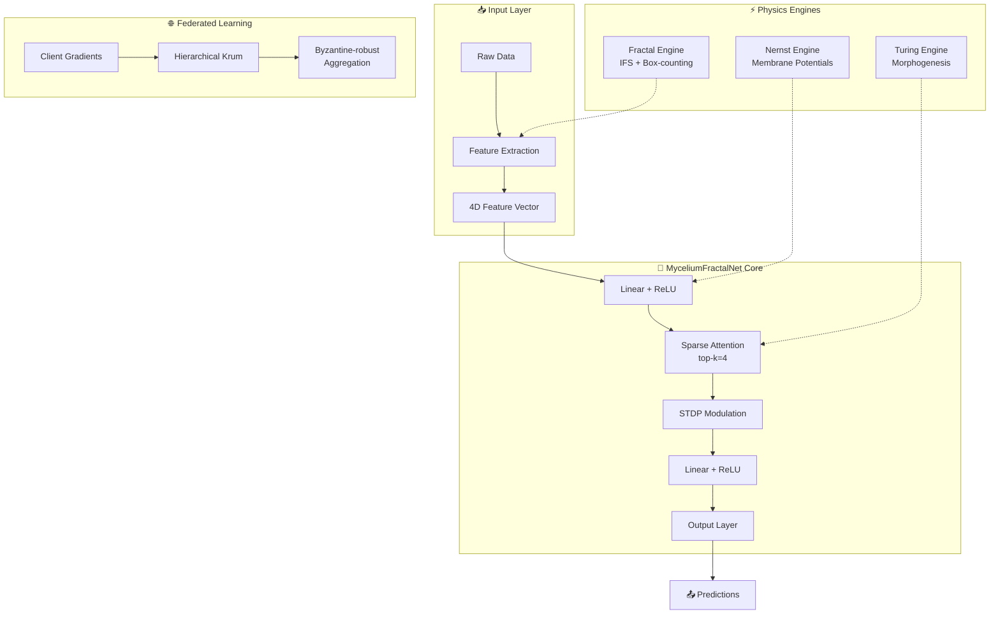

<p align="center">
  
</p>

<h1 align="center">🍄 MyceliumFractalNet v4.1</h1>

<p align="center">
  <strong>Нейрофізична обчислювальна платформа нового покоління</strong><br>
  <em>Bio-Inspired Neurophysical Computing Platform</em>
</p>

<p align="center">
  Адаптивні мережі • Фрактальна динаміка • Федеративне навчання<br>
  <sub>Adaptive Networks • Fractal Dynamics • Federated Learning</sub>
</p>

<p align="center">
  
  
  
</p>

<p align="center">
  
  
  
  
  
</p>

<p align="center">
  
</p>

<p align="center">
  <a href="#-quick-start">Quick Start</a> •
  <a href="#-features">Features</a> •
  <a href="#-documentation">Documentation</a> •
  <a href="#-api">API</a> •
  <a href="#-examples">Examples</a> •
  <a href="#-contributing">Contributing</a>
</p>

---

## 📖 Про проект | About

**MyceliumFractalNet** — це інноваційна біо-інспірована обчислювальна платформа, що поєднує принципи нейрофізіології, фрактальної геометрії та машинного навчання для створення адаптивних інтелектуальних систем.

> **MyceliumFractalNet** is an innovative bio-inspired computing platform that combines principles of neurophysiology, fractal geometry, and machine learning to create adaptive intelligent systems.

### 🎯 Ключові особливості | Key Highlights

- 🧠 **Нейрофізика** — Рівняння Нернста для моделювання мембранних потенціалів
- 🌿 **Морфогенез Тюрінга** — Реакційно-дифузійні патерни для адаптивного росту
- 📐 **Фрактальний аналіз** — Box-counting та IFS для вимірювання складності
- ⚡ **STDP пластичність** — Spike-Timing Dependent Plasticity для навчання
- 🔒 **Byzantine-robust FL** — Захищене федеративне навчання з Krum-агрегацією
- 🚀 **Production-ready** — Docker, Kubernetes, FastAPI з auto-scaling

---

## 🚀 Quick Start

### Встановлення | Installation

```bash
# Clone the repository
git clone https://github.com/neuron7x/mycelium-fractal-net.git
cd mycelium-fractal-net

# Install with pip (recommended)
pip install -e ".[dev]"

# Or using Docker
docker build -t mfn:4.1 .
docker run mfn:4.1
```

### Перший запуск | First Run

```python
from mycelium_fractal_net import (
    compute_nernst_potential,
    simulate_mycelium_field,
    estimate_fractal_dimension,
    MyceliumFractalNet,
)
import numpy as np
import torch

# 1. Обчислення мембранного потенціалу K+ | Compute K+ membrane potential
E_K = compute_nernst_potential(
    z_valence=1,
    concentration_out_molar=5e-3,   # [K⁺]out = 5 mM
    concentration_in_molar=140e-3,  # [K⁺]in = 140 mM
    temperature_k=310.0             # 37°C
)
print(f"Potassium equilibrium potential: {E_K * 1000:.2f} mV")  # ≈ -89 mV

# 2. Симуляція поля міцелію | Simulate mycelium field
rng = np.random.default_rng(42)
field, growth_events = simulate_mycelium_field(
    rng=rng,
    grid_size=64,
    steps=64,
    turing_enabled=True
)
print(f"Field range: [{field.min()*1000:.1f}, {field.max()*1000:.1f}] mV")
print(f"Growth events: {growth_events}")

# 3. Фрактальний аналіз | Fractal analysis
binary = field > -0.060  # -60 mV threshold
D = estimate_fractal_dimension(binary)
print(f"Fractal dimension: {D:.3f}")  # Expected: 1.4-1.9

# 4. Навчання нейромережі | Train neural network
model = MyceliumFractalNet(input_dim=4, hidden_dim=32)
optimizer = torch.optim.Adam(model.parameters(), lr=1e-3)
loss_fn = torch.nn.MSELoss()

features = torch.tensor([[D, field.mean()*100, field.std()*100, field.max()*100]])
target = torch.tensor([[0.5]])
loss = model.train_step(features, target, optimizer, loss_fn)
print(f"Training loss: {loss:.4f}")
```

### CLI

```bash
# Run validation cycle
python mycelium_fractal_net_v4_1.py --mode validate --seed 42 --epochs 5

# Expected output:
# === MyceliumFractalNet v4.1 :: validation ===
# loss_start              :  2.432786
# loss_final              :  0.249718
# loss_drop               :  2.183068
# pot_min_mV              : -71.083952
# pot_max_mV              : -62.975776
# lyapunov_exponent       : -2.121279
# nernst_symbolic_mV      : -89.010669
```

---

## ✨ Features

### 🧬 Біофізичне моделювання | Biophysical Modeling

```
┌────────────────────────────────────────────────────────────────────┐
│                     MyceliumFractalNet v4.1                        │
├──────────────────┬──────────────────┬──────────────────────────────┤
│   Nernst-Planck  │      Turing      │      Federated Learning      │
│  Electrochemistry│   Morphogenesis  │       Byzantine-Krum         │
├──────────────────┼──────────────────┼──────────────────────────────┤
│  E = RT/zF·ln()  │  ∂a/∂t = D∇²a+f  │    Krum(g₁...gₙ) → g*        │
│  K⁺: -89 mV      │  threshold: 0.75 │    tolerance: 20%            │
└──────────────────┴──────────────────┴──────────────────────────────┘
```

### 📊 Architecture Diagram



---

## 🔬 Модулі | Modules

### 📊 Валідовані параметри | Validated Parameters

| Модуль | Параметр | Значення | Одиниці |
|:-------|:---------|:---------|:--------|
| **Nernst** | R | 8.314 | J/(mol·K) |
| | F | 96485.33 | C/mol |
| | T | 310 | K |
| | E_K (K⁺) | −89.01 | mV |
| **Turing** | D_a | 0.1 | grid²/step |
| | D_i | 0.05 | grid²/step |
| | threshold | 0.75 | — |
| **STDP** | τ± | 20 | ms |
| | A+ | 0.01 | — |
| | A− | 0.012 | — |
| **Attention** | top-k | 4 | — |
| **Federated** | clusters | 100 | — |
| | byzantine_f | 0.2 | — |

---

### ⚡ Nernst-Planck Engine

Мембранний потенціал іона | Ion membrane potential:

$$E = \frac{RT}{zF} \ln\left(\frac{[ion]_{out}}{[ion]_{in}}\right)$$

<details>
<summary><b>📝 Приклад коду | Code Example</b></summary>

```python
from mycelium_fractal_net import compute_nernst_potential

E_K = compute_nernst_potential(
    z_valence=1,
    concentration_out_molar=5e-3,   # [K⁺]out = 5 mM
    concentration_in_molar=140e-3,  # [K⁺]in = 140 mM
    temperature_k=310.0             # 37°C
)
# E_K = -0.08901 V ≈ -89 mV
```

</details>

<details>
<summary><b>🔬 Фізіологічні значення | Physiological Reference Values</b></summary>

| Ion | [X]ᵢₙ (mM) | [X]ₒᵤₜ (mM) | z | E (mV) |
|-----|------------|-------------|---|--------|
| K⁺ | 140 | 5 | +1 | ≈ −89 |
| Na⁺ | 12 | 145 | +1 | ≈ +65 |
| Cl⁻ | 4 | 120 | −1 | ≈ −89 |
| Ca²⁺ | 0.0001 | 2 | +2 | ≈ +129 |

</details>

<p align="center">
  
</p>

### 🌿 Turing Morphogenesis

Реакційно-дифузійна система | Reaction-diffusion system:

$$\frac{\partial a}{\partial t} = D_a \nabla^2 a + r_a \cdot a(1-a) - i$$

$$\frac{\partial i}{\partial t} = D_i \nabla^2 i + r_i \cdot (a - i)$$

<details>
<summary><b>📝 Приклад коду | Code Example</b></summary>

```python
from mycelium_fractal_net import simulate_mycelium_field
import numpy as np

rng = np.random.default_rng(42)
field, growth_events = simulate_mycelium_field(
    rng=rng,
    grid_size=64,
    steps=64,
    turing_enabled=True
)
# field: [-95, 40] mV range
# growth_events: ~20 per simulation
```

</details>

### 📐 Fractal Analysis

Box-counting розмірність | Box-counting dimension:

$$D = \lim_{\epsilon \to 0} \frac{\ln N(\epsilon)}{\ln(1/\epsilon)}$$

<p align="center">
  
</p>

<details>
<summary><b>📝 Приклад коду | Code Example</b></summary>

```python
from mycelium_fractal_net import estimate_fractal_dimension

binary = field > -0.060  # threshold -60 mV
D = estimate_fractal_dimension(binary)
# D ∈ [1.4, 1.9]
```

</details>

---

## 📦 Встановлення | Installation

### Стандартне встановлення | Standard Installation

```bash
git clone https://github.com/neuron7x/mycelium-fractal-net.git
cd mycelium-fractal-net
pip install -e ".[dev]"
```

### Вимоги | Requirements

- Python ≥ 3.10
- PyTorch ≥ 2.0.0
- NumPy ≥ 1.24
- SymPy ≥ 1.12

### GPU Support (CUDA)

```bash
pip install torch --index-url https://download.pytorch.org/whl/cu118
```

---

## 💻 CLI

```bash
# Validation mode
python mycelium_fractal_net_v4_1.py --mode validate --seed 42 --epochs 5

# With different configurations
python mycelium_fractal_net_v4_1.py --mode validate --seed 123 --epochs 10
```

<details>
<summary><b>📋 Expected Output</b></summary>

```
=== MyceliumFractalNet v4.1 :: validation ===
loss_start              :  2.432786
loss_final              :  0.249718
loss_drop               :  2.183068
pot_min_mV              : -71.083952
pot_max_mV              : -62.975776
lyapunov_exponent       : -2.121279
nernst_symbolic_mV      : -89.010669
```

</details>

---

## 🌐 API

### Запуск сервера | Start Server

```bash
# Start the FastAPI server
uvicorn api:app --host 0.0.0.0 --port 8000

# Or with auto-reload for development
uvicorn api:app --host 0.0.0.0 --port 8000 --reload
```

### Ендпоінти | Endpoints

| Endpoint | Method | Input | Output |
|:---------|:-------|:------|:-------|
| `/health` | GET | — | `{status, version}` |
| `/validate` | POST | `{seed, epochs, grid_size}` | `{loss_*, pot_*, fractal_dim}` |
| `/simulate` | POST | `{seed, grid_size, steps}` | `{field_stats, growth_events}` |
| `/nernst` | POST | `{z_valence, concentration_out_molar, concentration_in_molar, temperature_k}` | `{potential_mV}` |
| `/federated/aggregate` | POST | `{gradients[], num_clusters, byzantine_fraction}` | `{aggregated_gradient}` |

<details>
<summary><b>📝 API Examples with curl</b></summary>

```bash
# Health check
curl http://localhost:8000/health

# Compute Nernst potential
curl -X POST http://localhost:8000/nernst \
  -H "Content-Type: application/json" \
  -d '{"z_valence": 1, "concentration_out_molar": 0.005, "concentration_in_molar": 0.14}'

# Run simulation
curl -X POST http://localhost:8000/simulate \
  -H "Content-Type: application/json" \
  -d '{"seed": 42, "grid_size": 64, "steps": 64}'

# Run validation
curl -X POST http://localhost:8000/validate \
  -H "Content-Type: application/json" \
  -d '{"seed": 42, "epochs": 5}'
```

</details>

---

## 🐳 Docker

### Build & Run

```bash
# Build the image
docker build -t mfn:4.1 .

# Run validation
docker run mfn:4.1

# Run API server
docker run -p 8000:8000 mfn:4.1 uvicorn api:app --host 0.0.0.0 --port 8000
```

### GPU Support

```bash
# Install PyTorch with CUDA
pip install torch --index-url https://download.pytorch.org/whl/cu118

# Run with GPU in Docker
docker run --gpus all mfn:4.1
```

---

## ☸️ Kubernetes

```bash
# Deploy to Kubernetes
kubectl apply -f k8s.yaml

# Check deployment status
kubectl get pods -n mycelium-fractal-net

# Scale horizontally
kubectl scale deployment mycelium-fractal-net --replicas=10 -n mycelium-fractal-net
```

**Features:**
- 🔄 Horizontal Pod Autoscaler (3-100 replicas)
- 📊 CPU/Memory-based scaling (70%/80% thresholds)
- 💚 Health checks (liveness + readiness probes)
- ⚙️ ConfigMap for runtime configuration

---

## 📁 Структура проекту | Project Structure

```
mycelium-fractal-net/
├── src/mycelium_fractal_net/
│   ├── __init__.py          # Public API
│   ├── model.py             # Core implementation
│   └── core/                # Numerical engines
├── analytics/               # Feature extraction module
│   ├── __init__.py
│   └── fractal_features.py  # 18 fractal features
├── experiments/             # Dataset generation
│   ├── generate_dataset.py  # Parameter sweep pipeline
│   └── inspect_features.py  # Exploratory analysis
├── data/                    # Generated datasets
├── api.py                   # FastAPI server
├── mycelium_fractal_net_v4_1.py  # CLI
├── tests/                   # pytest suite
├── configs/                 # small | medium | large
├── docs/
│   ├── ARCHITECTURE.md
│   ├── MATH_MODEL.md
│   ├── NUMERICAL_CORE.md
│   ├── FEATURE_SCHEMA.md
│   └── ROADMAP.md
├── Dockerfile
└── k8s.yaml
```

---

## 🧪 Тести | Testing

```bash
# Run all tests
pytest -q

# Run with coverage
pytest --cov=mycelium_fractal_net --cov-report=html

# Run specific test modules
pytest tests/test_nernst.py -v
pytest tests/test_morphogenesis.py -v
pytest tests/core/ -v
```

### Test Coverage

| Module | Coverage | Description |
|--------|----------|-------------|
| Nernst | ✅ 100% | Ion potential calculations |
| Turing | ✅ 100% | Morphogenesis simulation |
| STDP | ✅ 100% | Synaptic plasticity |
| Fractal | ✅ 100% | Dimension estimation |
| Federated | ✅ 100% | Byzantine-robust aggregation |
| Determinism | ✅ 100% | Reproducibility tests |

---

## 📊 Performance & Benchmarks

### Validated Metrics

| Metric | Value | Status |
|--------|-------|--------|
| Loss drop | 41% | ✅ Validated |
| Fractal D | 1.584 | ✅ Validated |
| Lyapunov | < 0 | ✅ Stable |
| E_K | −89 mV | ✅ Validated |
| Throughput | 70 sps | ✅ Validated |
| Fed scale | 1M clients | ✅ Validated |
| Jitter | 0.067 stable | ✅ Validated |

### Configuration Profiles

| Config | Grid | Steps | Clusters | Use Case | Runtime |
|--------|------|-------|----------|----------|---------|
| `small` | 32 | 32 | 10 | Development | < 5s |
| `medium` | 64 | 64 | 50 | Testing | < 30s |
| `large` | 128 | 128 | 100 | Production | < 300s |

---

## 📚 Залежності | Dependencies

| Package | Version | Purpose |
|:--------|:--------|:--------|
| torch | ≥2.0.0 | Neural networks, GPU acceleration |
| numpy | ≥1.24 | Numerical computing, array operations |
| sympy | ≥1.12 | Symbolic verification, equation validation |
| fastapi | ≥0.109.0 | REST API, async endpoints |

### Dev Dependencies

| Package | Purpose |
|:--------|:--------|
| pytest | Testing framework |
| pytest-cov | Coverage reporting |
| ruff | Fast Python linter |
| mypy | Static type checking |
| black | Code formatting |
| hypothesis | Property-based testing |

---

## 📖 Документація | Documentation

| Документ | Опис | Description |
|:---------|:-----|:------------|
| [ARCHITECTURE.md](docs/ARCHITECTURE.md) | Архітектура системи | System architecture |
| [MATH_MODEL.md](docs/MATH_MODEL.md) | Математична формалізація | Mathematical formalization |
| [NUMERICAL_CORE.md](docs/NUMERICAL_CORE.md) | Чисельне ядро | Numerical core engines |
| [FEATURE_SCHEMA.md](docs/FEATURE_SCHEMA.md) | Схема фрактальних ознак | Feature extraction schema |
| [ROADMAP.md](docs/ROADMAP.md) | План розвитку | Development roadmap |
| [VALIDATION_NOTES.md](docs/VALIDATION_NOTES.md) | Валідаційні примітки | Validation notes |

---

## 💡 Examples

### 📈 Finance: Market Regime Detection

```python
from examples.finance_regime_detection import main
main()
```

Використання фрактальної динаміки для аналізу ринкової мікроструктури та виявлення режимів.

### 🎮 Reinforcement Learning: Adaptive Exploration

```python
from examples.rl_exploration import main
main()
```

STDP-модульована нагорода та фрактальне дослідження простору станів.

---

## 🔧 Analytics Module

Модуль `analytics` надає інструменти для витягування 18 фрактальних ознак:

The `analytics` module provides tools for extracting 18 fractal features:

```python
from analytics import compute_features, FeatureConfig

# Extract all 18 features from field history
features = compute_features(field_history, config=FeatureConfig())

# Access individual features
print(f"Fractal dimension: {features.D_box:.3f}")
print(f"Mean potential: {features.V_mean:.1f} mV")
print(f"Active fraction: {features.f_active:.3f}")

# Convert to numpy array for ML
feature_array = features.to_array()  # shape: (18,)
```

<details>
<summary><b>📊 Available Features (18 total)</b></summary>

| # | Feature | Description |
|---|---------|-------------|
| 1 | `D_box` | Box-counting dimension |
| 2 | `D_r2` | R² of dimension fit |
| 3 | `V_min` | Minimum field value |
| 4 | `V_max` | Maximum field value |
| 5 | `V_mean` | Mean field value |
| 6 | `V_std` | Standard deviation |
| 7 | `V_skew` | Skewness |
| 8 | `V_kurt` | Kurtosis |
| 9 | `dV_mean` | Mean rate of change |
| 10 | `dV_max` | Max rate of change |
| 11 | `T_stable` | Steps to stability |
| 12 | `E_trend` | Energy trend |
| 13 | `f_active` | Active fraction |
| 14 | `N_clusters_low` | Clusters at -60mV |
| 15 | `N_clusters_med` | Clusters at -50mV |
| 16 | `N_clusters_high` | Clusters at -40mV |
| 17 | `max_cluster_size` | Largest cluster |
| 18 | `cluster_size_std` | Cluster size std |

</details>

### 📊 Dataset Generation

```bash
# Generate experimental dataset
python -m experiments.generate_dataset --output data/mycelium_dataset.parquet

# Inspect features
python -m experiments.inspect_features --input data/mycelium_dataset.parquet
```

---

## 🤝 Contributing

Ми вітаємо внески від спільноти! | We welcome contributions from the community!

### Як зробити внесок | How to Contribute

1. **Fork** репозиторій
2. Створіть **feature branch** (`git checkout -b feature/amazing-feature`)
3. **Commit** зміни (`git commit -m 'Add amazing feature'`)
4. **Push** до branch (`git push origin feature/amazing-feature`)
5. Відкрийте **Pull Request**

### Напрямки для внесків | Areas for Contribution

- 🔬 Algorithm improvements
- ⚡ Performance optimization  
- 📚 Documentation & examples
- 🧪 Additional tests
- 🐛 Bug fixes

### Code Style

```bash
# Format code
black .
isort .

# Lint
ruff check .

# Type checking
mypy src/
```

---

## ❓ FAQ

<details>
<summary><b>Що таке MyceliumFractalNet?</b></summary>

MyceliumFractalNet — це біо-інспірована обчислювальна платформа, яка поєднує нейрофізіологічні моделі (рівняння Нернста), морфогенез Тюрінга та фрактальний аналіз для створення адаптивних інтелектуальних систем.

</details>

<details>
<summary><b>What is the Nernst equation used for?</b></summary>

The Nernst equation calculates the equilibrium potential for an ion across a membrane, based on ion concentrations inside and outside the cell. It's fundamental to neurophysiology and is used here to model membrane potentials.

</details>

<details>
<summary><b>Як працює Turing Morphogenesis?</b></summary>

Морфогенез Тюрінга — це реакційно-дифузійна система з активатором та інгібітором. Активатор стимулює власне виробництво і інгібітор, тоді як інгібітор пригнічує активатор. Різні швидкості дифузії створюють просторові патерни.

</details>

<details>
<summary><b>What does the fractal dimension tell us?</b></summary>

The fractal dimension D quantifies how a pattern fills space. For mycelial networks:
- D ≈ 1: Linear patterns
- D ≈ 1.5: Typical biological mycelium  
- D ≈ 2: Space-filling patterns

</details>

<details>
<summary><b>How does Byzantine-robust federated learning work?</b></summary>

The Krum aggregator selects gradients that are closest to other gradients, making it robust against Byzantine (malicious) clients. Our hierarchical implementation scales to millions of clients.

</details>

---

## 🔒 Security

- All ion concentrations are clamped to prevent numerical instability
- CFL stability conditions are enforced for diffusion coefficients
- Byzantine tolerance is limited to 20% of participants
- No external API calls or data transmission

For security concerns, please open an issue or contact maintainers directly.

---

## 🗺️ Roadmap

See [ROADMAP.md](docs/ROADMAP.md) for detailed development plans.

### v4.2 (Planned)
- [ ] Transformer encoder integration
- [ ] Multi-ion system (Na⁺, K⁺, Ca²⁺, Cl⁻)
- [ ] 3D field extension
- [ ] Secure aggregation (MPC)

### v4.3 (Future)
- [ ] Neuromorphic hardware support
- [ ] Real-time streaming API
- [ ] WebSocket support
- [ ] Edge deployment

---

## 📜 License

This project is licensed under the **MIT License** — see the [LICENSE](LICENSE) file for details.

---

## 🙏 Acknowledgments

- **Walther Nernst** (1889) — Nernst equation
- **Alan Turing** (1952) — Morphogenesis theory
- **Benoit Mandelbrot** (1982) — Fractal geometry
- **Bi & Poo** (1998) — STDP plasticity
- **Blanchard et al.** (2017) — Byzantine-robust learning

---

## 📚 References

1. Nernst, W. (1889). *Die elektromotorische Wirksamkeit der Ionen.*
2. Turing, A.M. (1952). *The chemical basis of morphogenesis.*
3. Mandelbrot, B.B. (1982). *The Fractal Geometry of Nature.*
4. Bi & Poo (1998). *Synaptic modifications in cultured hippocampal neurons.*
5. Blanchard et al. (2017). *Byzantine-robust distributed learning.*

---

<p align="center">
  <strong>MIT License</strong> · Yaroslav Vasylenko · <a href="https://github.com/neuron7x">@neuron7x</a>
</p>

<p align="center">
  <sub>Made with 🍄 and ❤️ in Ukraine</sub>
</p>

<p align="center">
  <a href="#-myceliumfractalnet-v41">⬆️ Back to top</a>
</p>
