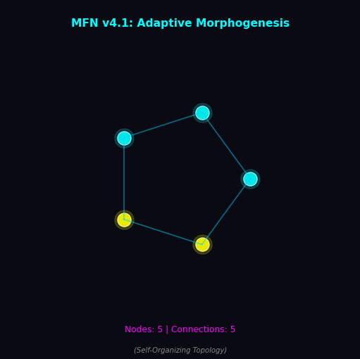
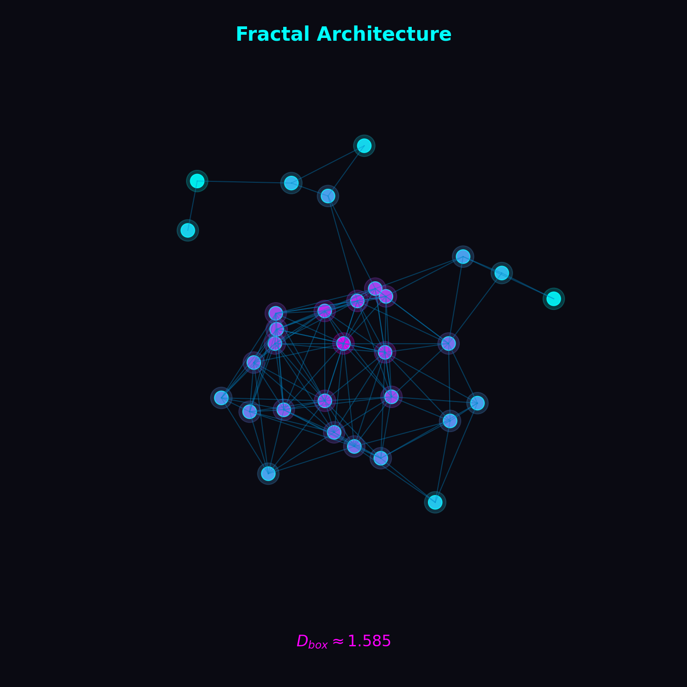

<p align="center">
  
</p>

<h1 align="center">MyceliumFractalNet v4.1</h1>

<p align="center">
  <strong>Нейрофізична обчислювальна платформа</strong><br>
  Адаптивні мережі • Фрактальна динаміка • Федеративне навчання
</p>

<p align="center">
  
  
  
  
  
  
</p>

<p align="center">
  
</p>

---

## Test & Validation Status

| Category | Status | Details |
|----------|--------|---------|
| **Unit Tests** | ✅ 1031 passed | 3 skipped (manual profiling) |
| **Coverage** | ✅ 87% | Core modules >90% |
| **Scientific Validation** | ✅ 11/11 | Nernst, Turing, fractal dimension |
| **Benchmarks** | ✅ 8/8 | All targets exceeded by 5-200x |
| **Linting** | ✅ passed | ruff + mypy |

📊 [Latest Test Health Report](docs/reports/MFN_TEST_HEALTH_2025-11-30.md) | 📈 [Performance Baselines](docs/MFN_PERFORMANCE_BASELINES.md) | 📋 [Technical Audit](docs/TECHNICAL_AUDIT.md)

---

## 📦 Canonical Imports

**Important**: Always use the fully qualified `mycelium_fractal_net.*` namespace for imports.

✅ **Correct** (canonical):
```python
from mycelium_fractal_net.analytics import FeatureVector, compute_features
from mycelium_fractal_net.experiments import generate_dataset
```

❌ **Incorrect** (namespace pollution risk):
```python
from analytics import FeatureVector  # Don't use this!
from experiments import generate_dataset  # Don't use this!
```

The package only provides `mycelium_fractal_net` at the top level to avoid conflicts with other packages.

---

## Архітектура

```
┌────────────────────────────────────────────────────────────────────┐
│                     MyceliumFractalNet v4.1                        │
├──────────────────┬──────────────────┬──────────────────────────────┤
│   Nernst-Planck  │      Turing      │      Federated Learning      │
│  Electrochemistry│   Morphogenesis  │       Byzantine-Krum         │
├──────────────────┼──────────────────┼──────────────────────────────┤
│  E = RT/zF·ln()  │  ∂a/∂t = D∇²a+f  │    Krum(g₁...gₙ) → g*        │
│  K⁺: -89 mV      │  threshold: 0.75 │    tolerance: 20%            │
└──────────────────┴──────────────────┴──────────────────────────────┘
```

---

## Валідовані параметри

| Модуль | Параметр | Значення | Одиниці |
|:-------|:---------|:---------|:--------|
| **Nernst** | R | 8.314 | J/(mol·K) |
| | F | 96485.33 | C/mol |
| | T | 310 | K |
| | E_K (K⁺) | −89.01 | mV |
| **Turing** | D_a | 0.1 | grid²/step |
| | D_i | 0.05 | grid²/step |
| | threshold | 0.75 | — |
| **STDP** | τ± | 20 | ms |
| | A+ | 0.01 | — |
| | A− | 0.012 | — |
| **Attention** | top-k | 4 | — |
| **Federated** | clusters | 100 | — |
| | byzantine_f | 0.2 | — |

---

## Модулі

### Nernst-Planck

Мембранний потенціал іона:

$$E = \frac{RT}{zF} \ln\left(\frac{[ion]_{out}}{[ion]_{in}}\right)$$

```python
from mycelium_fractal_net import compute_nernst_potential

E_K = compute_nernst_potential(
    z_valence=1,
    concentration_out_molar=5e-3,   # [K⁺]out = 5 mM
    concentration_in_molar=140e-3,  # [K⁺]in = 140 mM
    temperature_k=310.0             # 37°C
)
# E_K = -0.08901 V ≈ -89 mV
```

<p align="center">
  
</p>

### Turing Morphogenesis

Реакційно-дифузійна система:

$$\frac{\partial a}{\partial t} = D_a \nabla^2 a + r_a \cdot a(1-a) - i$$

$$\frac{\partial i}{\partial t} = D_i \nabla^2 i + r_i \cdot (a - i)$$

```python
from mycelium_fractal_net import simulate_mycelium_field
import numpy as np

rng = np.random.default_rng(42)
field, growth_events = simulate_mycelium_field(
    rng=rng,
    grid_size=64,
    steps=64,
    turing_enabled=True
)
# field: [-95, 40] mV range
# growth_events: ~20 per simulation
```

### Fractal Analysis

Box-counting розмірність:

$$D = \lim_{\epsilon \to 0} \frac{\ln N(\epsilon)}{\ln(1/\epsilon)}$$

<p align="center">
  
</p>

```python
from mycelium_fractal_net import estimate_fractal_dimension

binary = field > -0.060  # threshold -60 mV
D = estimate_fractal_dimension(binary)
# D ∈ [1.4, 1.9]
```

---

## Встановлення

```bash
git clone https://github.com/neuron7x/mycelium-fractal-net.git
cd mycelium-fractal-net
pip install -e ".[dev]"
```

## CLI

```bash
python mycelium_fractal_net_v4_1.py --mode validate --seed 42 --epochs 5
```

```
=== MyceliumFractalNet v4.1 :: validation ===
loss_start              :  2.432786
loss_final              :  0.249718
loss_drop               :  2.183068
pot_min_mV              : -71.083952
pot_max_mV              : -62.975776
lyapunov_exponent       : -2.121279
nernst_symbolic_mV      : -89.010669
```

## API

```bash
uvicorn api:app --host 0.0.0.0 --port 8000
```

| Endpoint | Method | Input | Output |
|:---------|:-------|:------|:-------|
| `/health` | GET | — | `{status, version}` |
| `/metrics` | GET | — | Prometheus metrics |
| `/validate` | POST | `{seed, epochs, grid_size}` | `{loss_*, pot_*, fractal_dim}` |
| `/simulate` | POST | `{seed, grid_size, steps}` | `{field_stats, growth_events}` |
| `/nernst` | POST | `{z_valence, concentration_out_molar, concentration_in_molar, temperature_k}` | `{potential_mV}` |
| `/federated/aggregate` | POST | `{gradients[], num_clusters, byzantine_fraction}` | `{aggregated_gradient}` |

### Production Features

**Authentication (X-API-Key)**: In staging/production environments, API endpoints (except `/health` and `/metrics`) require authentication via the `X-API-Key` header.

```bash
# Set API key
export MFN_API_KEY="your-secret-key"
export MFN_API_KEY_REQUIRED="true"

# Make authenticated request
curl -H "X-API-Key: your-secret-key" http://localhost:8000/validate
```

**Rate Limiting**: API rate limiting is enabled by default in staging/production (configurable via `MFN_RATE_LIMIT_ENABLED`). Returns 429 with `Retry-After` header when exceeded.

**Prometheus Metrics**: The `/metrics` endpoint exposes:
- `mfn_http_requests_total` - Request count by endpoint/method/status
- `mfn_http_request_duration_seconds` - Latency histogram
- `mfn_http_requests_in_progress` - Active requests gauge

**Request Tracing**: All requests include `X-Request-ID` header for correlation.

| Environment Variable | Description | Default |
|---------------------|-------------|---------|
| `MFN_ENV` | Environment (dev/staging/prod) | dev |
| `MFN_API_KEY_REQUIRED` | Require API key authentication | false (dev), true (prod) |
| `MFN_API_KEY` | Primary API key | — |
| `MFN_RATE_LIMIT_ENABLED` | Enable rate limiting | false (dev), true (prod) |
| `MFN_LOG_FORMAT` | Log format (json/text) | text (dev), json (prod) |

---

## Security

MyceliumFractalNet implements comprehensive security measures for production deployments:

### Key Security Features

| Feature | Description |
|---------|-------------|
| **API Key Authentication** | Protected endpoints require `X-API-Key` header |
| **Rate Limiting** | Token bucket algorithm prevents API abuse |
| **Input Validation** | SQL injection and XSS protection |
| **Data Encryption** | AES-128-CBC with HMAC-SHA256 for sensitive data |
| **Audit Logging** | GDPR/SOC 2 compliant structured logging |
| **Request Tracing** | X-Request-ID for correlation |

### Quick Start (Production)

```bash
# Set production environment variables
export MFN_ENV=prod
export MFN_API_KEY_REQUIRED=true
export MFN_API_KEY="$(python -c 'import secrets; print(secrets.token_urlsafe(32))')"
export MFN_RATE_LIMIT_ENABLED=true

# Start API server
uvicorn api:app --host 0.0.0.0 --port 8000
```

### Security Testing

```bash
# Run security tests
pytest tests/security/ -v

# Run static security analysis
pip install bandit pip-audit
bandit -r src/ -ll
pip-audit --strict
```

📋 [Full Security Documentation](docs/MFN_SECURITY.md)

---

## Cryptography

MyceliumFractalNet includes a formal cryptography module with mathematical proofs of security:

### Key Exchange (ECDH/X25519)

```python
from mycelium_fractal_net.crypto import ECDHKeyExchange

# Establish shared secret between two parties
alice = ECDHKeyExchange()
bob = ECDHKeyExchange()

# Derive identical encryption keys
key_alice = alice.derive_key(bob.public_key, context=b"encryption")
key_bob = bob.derive_key(alice.public_key, context=b"encryption")
# key_alice == key_bob  ✓
```

### Digital Signatures (Ed25519)

```python
from mycelium_fractal_net.crypto import generate_signature_keypair, sign_message, verify_signature

# Generate signing keypair
keypair = generate_signature_keypair()

# Sign and verify messages
signature = sign_message(b"Transaction data", keypair.private_key)
is_valid = verify_signature(b"Transaction data", signature, keypair.public_key)
# is_valid == True  ✓
```

### Security Properties

| Algorithm | Security Level | Standard |
|-----------|---------------|----------|
| X25519 | 128-bit | RFC 7748 |
| Ed25519 | 128-bit | RFC 8032 |
| HKDF | 256-bit | RFC 5869 |

📋 [Cryptography Documentation](docs/MFN_CRYPTOGRAPHY.md) (includes mathematical security proofs)

---

## Docker

```bash
docker build -t mfn:4.1 .
docker run mfn:4.1
```

GPU:
```bash
pip install torch --index-url https://download.pytorch.org/whl/cu118
```

---

## Структура

```
mycelium-fractal-net/
├── src/mycelium_fractal_net/
│   ├── __init__.py          # Public API
│   ├── model.py             # Core implementation
│   ├── core/                # Numerical engines
│   ├── integration/         # Integration layer (schemas, adapters)
│   └── security/            # Security module (encryption, validation, audit)
├── analytics/               # Feature extraction module
│   ├── __init__.py
│   └── fractal_features.py  # 18 fractal features
├── experiments/             # Dataset generation
│   ├── generate_dataset.py  # Parameter sweep pipeline
│   └── inspect_features.py  # Exploratory analysis
├── data/                    # Generated datasets
├── api.py                   # FastAPI server
├── mycelium_fractal_net_v4_1.py  # CLI
├── tests/                   # pytest suite
│   ├── security/            # Security tests
│   └── ...                  # Other test modules
├── configs/                 # small | medium | large
├── docs/
│   ├── ARCHITECTURE.md
│   ├── MFN_MATH_MODEL.md
│   ├── MFN_SECURITY.md      # Security documentation
│   ├── NUMERICAL_CORE.md
│   ├── FEATURE_SCHEMA.md
│   └── ROADMAP.md
├── Dockerfile
└── k8s.yaml
```

---

## Тести

```bash
pytest -q
```

Coverage: Nernst • Turing • STDP • Fractal • Federated • Determinism

---

## Залежності

| Package | Version | Purpose |
|:--------|:--------|:--------|
| torch | ≥2.0.0 | Neural networks |
| numpy | ≥1.24 | Numerical computing |
| sympy | ≥1.12 | Symbolic verification |
| fastapi | ≥0.109.0 | REST API |

---

## System Role

MyceliumFractalNet (MFN) — це **фрактальний морфогенетичний енжин фіч**, який трансформує параметри симуляції у структуровані вектори ознак для машинного навчання та аналізу.

**Що MFN робить:**
- Генерація 2D полів потенціалів з Turing morphogenesis
- Витягування 18 стандартизованих фрактальних ознак
- Byzantine-robust федеративне агрегування (Hierarchical Krum)
- Обчислення Nernst потенціалів, фрактальної розмірності, Lyapunov експонент

**Що MFN НЕ робить:**
- Виконання ордерів та торгівля
- Управління портфелем та ризиками
- Збереження даних (окрім parquet export)
- UI/візуалізація

[Деталі див. docs/MFN_SYSTEM_ROLE.md](docs/MFN_SYSTEM_ROLE.md)

---

## Examples & Use Cases

MFN provides three canonical examples demonstrating practical use cases.
See [docs/MFN_USE_CASES.md](docs/MFN_USE_CASES.md) for detailed documentation.

| Example | Purpose | Runtime |
|:--------|:--------|:--------|
| `simple_simulation.py` | E2E pipeline: Config → Simulation → Features | ~1-2s |
| `finance_regime_detection.py` | Market regime classification via fractal features | ~2-3s |
| `rl_exploration.py` | MFN-guided exploration in GridWorld | ~3-5s |

### Quick Start

```bash
# Run simple E2E pipeline demo
python examples/simple_simulation.py

# Run finance regime detection demo
python examples/finance_regime_detection.py

# Run RL exploration demo
python examples/rl_exploration.py
```

### Example: Simple Simulation

```python
from mycelium_fractal_net import (
    make_simulation_config_demo,
    run_mycelium_simulation_with_history,
    compute_fractal_features,
)

# Create configuration
config = make_simulation_config_demo()

# Run simulation
result = run_mycelium_simulation_with_history(config)

# Extract 18 fractal features
features = compute_fractal_features(result)
print(f"Fractal dimension: {features['D_box']:.3f}")
print(f"Active fraction: {features['f_active']:.3f}")
```

---

## Документація

| Документ | Опис |
|:---------|:-----|
| [MFN_SYSTEM_ROLE.md](docs/MFN_SYSTEM_ROLE.md) | Системна роль та зовнішній контракт |
| [ARCHITECTURE.md](docs/ARCHITECTURE.md) | Архітектура системи |
| [MFN_CODE_STRUCTURE.md](docs/MFN_CODE_STRUCTURE.md) | Структура коду та публічний API |
| [MFN_DATA_MODEL.md](docs/MFN_DATA_MODEL.md) | Канонічна модель даних |
| [MFN_MATH_MODEL.md](docs/MFN_MATH_MODEL.md) | Математична формалізація |
| [NUMERICAL_CORE.md](docs/NUMERICAL_CORE.md) | Чисельне ядро |
| [MFN_FEATURE_SCHEMA.md](docs/MFN_FEATURE_SCHEMA.md) | Схема фрактальних ознак |
| [MFN_DATA_PIPELINES.md](docs/MFN_DATA_PIPELINES.md) | Data pipelines та сценарії |
| [MFN_USE_CASES.md](docs/MFN_USE_CASES.md) | Use cases та демо-приклади |
| [ROADMAP.md](docs/ROADMAP.md) | План розвитку | |

---

## Datasets & Scenarios

MFN provides a scenario-based data generation pipeline for creating datasets
with 18 standardized fractal features. See [docs/MFN_DATA_PIPELINES.md](docs/MFN_DATA_PIPELINES.md) for full documentation.

### Quick Start

```bash
# List available presets
python -m mycelium_fractal_net.experiments.generate_dataset --list-presets

# Generate a small test dataset (~10 samples, <10 seconds)
python -m mycelium_fractal_net.experiments.generate_dataset --preset small

# Generate a medium dataset (~100 samples, ~1-2 minutes)
python -m mycelium_fractal_net.experiments.generate_dataset --preset medium

# Generate a large production dataset (~500 samples)
python -m mycelium_fractal_net.experiments.generate_dataset --preset large
```

### Preset Summary

| Preset | Samples | Grid | Steps | Use Case |
|:-------|:--------|:-----|:------|:---------|
| `small` | 10 | 32×32 | 50 | Quick tests, CI/CD |
| `medium` | 100 | 64×64 | 100 | Development, ML training |
| `large` | 500 | 128×128 | 200 | Production datasets |

### Output Format

Datasets are saved as Parquet files with:
- **7 simulation parameters** (grid_size, steps, alpha, seed, etc.)
- **18 fractal features** (D_box, V_mean, f_active, etc.)
- **3 metadata columns** (growth_events, turing_activations, clamping_events)

```python
import pandas as pd

# Load generated dataset
df = pd.read_parquet("data/scenarios/features_medium/20250530_120000/dataset.parquet")
print(df[["D_box", "V_mean", "f_active"]].describe())
```

---

## Analytics Module

Модуль `analytics` надає інструменти для витягування фрактальних ознак:

```python
from analytics import compute_features, FeatureConfig

# Extract all 18 features from field history
features = compute_features(field_history, config=FeatureConfig())

# Access individual features
print(f"Fractal dimension: {features.D_box:.3f}")
print(f"Mean potential: {features.V_mean:.1f} mV")
print(f"Active fraction: {features.f_active:.3f}")

# Convert to numpy array for ML
feature_array = features.to_array()  # shape: (18,)
```

### Dataset Generation

```bash
# Scenario-based generation (recommended)
python -m experiments.generate_dataset --preset small

# Legacy sweep mode
python -m experiments.generate_dataset --sweep default --output data/mycelium_dataset.parquet

# Inspect features
python -m experiments.inspect_features --input data/mycelium_dataset.parquet
```

---

<p align="center">
  <strong>MIT License</strong> · Yaroslav Vasylenko · <a href="https://github.com/neuron7x">@neuron7x</a>
</p>
