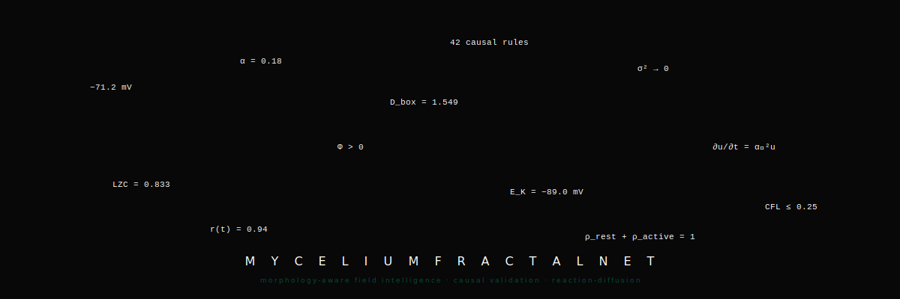

<p align="center">
  
</p>

<h1 align="center">MyceliumFractalNet</h1>
<h3 align="center">Morphology-aware Field Intelligence Engine</h3>

<p align="center">
  Deterministic simulation, feature extraction, anomaly detection, and causal verification<br />
  for reaction-diffusion systems with biophysical kinetics.
</p>

<p align="center">
  
  
  
  
  
  <a href="LICENSE"></a>
</p>

---

## Overview

MFN simulates biological pattern formation on a 2D lattice, extracts morphological features, classifies regimes, forecasts field evolution, compares states, and **proves that every conclusion is causally consistent** before publishing it.

```python
import mycelium_fractal_net as mfn

seq = mfn.simulate(mfn.SimulationSpec(grid_size=64, steps=32, seed=42))

seq.detect()       # → AnomalyEvent(label=nominal, score=0.18, confidence=0.79)
seq.extract()      # → MorphologyDescriptor(57-dim embedding, 6 feature groups)
seq.forecast(4)    # → ForecastResult(horizon=4, structural_error=0.039)
seq.compare(seq)   # → ComparisonResult(label=near-identical, distance=0.0)
```

Every result passes through a **Causal Validation Gate** — 42 rules across 7 pipeline stages. If a conclusion does not follow from the data, the system blocks it.

---

## Key Features

| | Feature | Description |
|---|---|---|
| **Explainability** | Evidence-backed detection | Every anomaly comes with contributing features, confidence score, and evidence payload. No black boxes. |
| **Causal Gate** | 41 verification rules | Falsifiable cause-effect rules across simulation, extraction, detection, forecasting, comparison, cross-stage, and perturbation stages. |
| **Biophysics** | Real kinetics | Nernst equation, Turing morphogenesis, GABA-A MWC allosteric model, serotonergic plasticity, occupancy conservation. |
| **Provenance** | Ed25519 artifact signing | Every report and manifest is cryptographically signed. Immutable audit trail. |
| **Performance** | 27M cells/sec | Full pipeline (simulate → detect → forecast) in ~77 ms for 64×64 grids. Memmap history for large-scale runs. |
| **Contracts** | 7 import boundaries | Module dependencies enforced by import-linter in CI. Architecture cannot silently degrade. |

---

## Use Cases

| Domain | Application |
|--------|-------------|
| **Computational Neuroscience** | GABA-A receptor kinetics, serotonergic plasticity, neuromodulation with occupancy conservation laws |
| **Drug Discovery** | In-silico screening — does a compound stabilize or destabilize neural network patterns? |
| **Anomaly Detection** | Regime classification (stable / transitional / critical / reorganized / pathological) with causal evidence |
| **Scientific Computing** | Verified pipelines — every artifact signed, every decision traceable, every threshold versioned |

---

## Architecture

```
SimulationSpec
     │
     ▼
  simulate ──→ FieldSequence(NxN, T steps, V ∈ [-95, +40] mV)
     │
     ├──→ extract  ──→ MorphologyDescriptor(57-dim embedding, 6 feature groups)
     ├──→ detect   ──→ AnomalyEvent(label + regime + evidence)
     ├──→ forecast ──→ ForecastResult(predicted states + uncertainty)
     ├──→ compare  ──→ ComparisonResult(distance + topology drift)
     │
     ▼
  Causal Validation Gate ──→ 42 rules across 7 stages
     │
     ▼
  report ──→ Signed artifact bundle (JSON, HTML, causal_validation.json)
```

### Module Structure

```
src/mycelium_fractal_net/
├── types/          Pure frozen dataclasses — the type system (30 types)
├── core/           PDE solver, detect, forecast, compare, causal validation
├── analytics/      Feature extraction, morphology, connectivity, temporal
├── neurochem/      GABA-A kinetics, serotonergic plasticity, MWC model
├── security/       Input validation, encryption, audit, hardening
├── integration/    API server, adapters, schemas, authentication
├── pipelines/      Report generation, scenario presets
├── numerics/       Grid operations, Laplacian, CFL stability
└── cli.py          Terminal interface with color output
```

Layer boundaries are enforced by 7 import-linter contracts — see [Architecture](docs/ARCHITECTURE.md).

---

## Installation

### Quick start (CPU-only)

```bash
git clone https://github.com/neuron7x/mycelium-fractal-net.git
cd mycelium-fractal-net
pip install -e ".[dev]"
```

### With uv (recommended)

```bash
uv sync --group dev
```

### Profiles

| Profile | Command | What you get |
|---------|---------|--------------|
| Core | `pip install -e .` | Simulation, detection, forecasting — no ML, no acceleration |
| Dev | `pip install -e ".[dev]"` | Core + pytest, ruff, mypy, hypothesis, benchmarks |
| ML | `pip install -e ".[ml]"` | Core + PyTorch for neural network surfaces |
| Accel | `pip install -e ".[accel]"` | Core + Numba JIT-compiled Laplacian |
| Security | `pip install -e ".[security]"` | Core + bandit, pip-audit, checkov |
| Full | `pip install -e ".[full]"` | Everything |

**Requirements:** Python ≥ 3.10, < 3.14

---

## CLI

```bash
# Simulate a 64×64 field for 32 steps
mfn simulate --seed 42 --grid-size 64 --steps 32

# Detect anomalies with regime classification
mfn detect --seed 42 --grid-size 64 --steps 32

# Full pipeline report with signed artifacts
mfn report --seed 42 --grid-size 64 --steps 32 --output-root ./results

# Machine-readable JSON output
mfn --json simulate --seed 42
```

<details>
<summary><strong>Example output</strong></summary>

```
Simulation
──────────────
  Grid:     64×64
  Steps:    32
  Seed:     42
  Alpha:    0.18
  Field:    [-71.0, -3.6] mV  mean=-50.2 mV
  Hash:     a1b2c3d4e5f6g7h8

Detection
─────────────
  Anomaly:  nominal   score=0.184  conf=0.79
  Regime:   stable    score=0.650
  Drivers:  dynamic_threshold, instability_index, near_transition_score
```

</details>

### Neuromodulation

```bash
# GABA-A tonic inhibition with muscimol
mfn simulate --seed 42 --grid-size 64 --steps 32 \
    --neuromod-profile gabaa_tonic_muscimol_alpha1beta3 \
    --agonist-concentration-um 0.5

# Serotonergic reorganization candidate
mfn simulate --seed 42 --grid-size 64 --steps 32 \
    --neuromod-profile serotonergic_reorganization_candidate
```

---

## REST API

```bash
mfn api --host 0.0.0.0 --port 8000
```

| Endpoint | Method | Description |
|----------|--------|-------------|
| `/health` | GET | Engine status, version, uptime |
| `/metrics` | GET | Prometheus-format request counters and latency |
| `/v1/simulate` | POST | Run simulation with optional neuromodulation |
| `/v1/extract` | POST | Extract morphology descriptor |
| `/v1/detect` | POST | Anomaly detection with regime classification |
| `/v1/forecast` | POST | Forecast field evolution |
| `/v1/compare` | POST | Compare two field states |
| `/v1/report` | POST | Full pipeline with causal validation |

**Security:** API key authentication (`X-API-Key`), rate limiting, CORS, CSP/HSTS headers, request size limits, output sanitization.

Full reference: [API Documentation](docs/API.md) · OpenAPI schema: [`docs/contracts/openapi.v2.json`](docs/contracts/openapi.v2.json)

---

## Causal Validation

Every report includes `causal_validation.json` — a machine-readable proof that conclusions follow from data:

```
CausalValidation(decision=pass, rules=33/33, errors=0, warnings=0)
```

42 rules organized across 7 stages:

| Stage | Rules | What is verified |
|-------|-------|-----------------|
| **SIM** | 11 | Field bounds, NaN/Inf, CFL stability, occupancy conservation, MWC monotonicity |
| **EXT** | 6 | Embedding validity, descriptor completeness, feature-group integrity |
| **DET** | 8 | Score bounds, label vocabulary, confidence range, evidence consistency |
| **FOR** | 6 | Horizon validity, prediction bounds, uncertainty envelope, damping range |
| **CMP** | 6 | Distance non-negativity, cosine bounds, label-metric consistency |
| **XST** | 3 | Cross-stage logical coherence (regime ↔ anomaly, neuromod ↔ plasticity) |
| **PTB** | 2 | Label stability under ε=10⁻⁶ perturbation (3 noise seeds) |

**Failure modes:** `PASS` → report published · `DEGRADED` → warnings logged, report published · `FAIL` → report blocked, no artifacts emitted.

Full rule catalog: [Causal Validation](docs/CAUSAL_VALIDATION.md)

---

## Neuromodulation

Optional biophysical neuromodulation with GABA-A and serotonergic kinetics:

```python
spec = mfn.SimulationSpec(
    grid_size=64, steps=32, seed=42,
    neuromodulation=mfn.NeuromodulationSpec(
        profile="gabaa_tonic_muscimol_alpha1beta3",
        enabled=True,
        gabaa_tonic=mfn.GABAATonicSpec(
            agonist_concentration_um=0.5,
            shunt_strength=0.3,
        ),
    ),
)
seq = mfn.simulate(spec)
```

**Occupancy conservation** (resting + active + desensitized = 1.0) is enforced at runtime and verified by causal rule `SIM-008`.

Available profiles: `baseline_nominal` · `gabaa_tonic_muscimol_alpha1beta3` · `gabaa_tonic_extrasynaptic_delta_high_affinity` · `serotonergic_reorganization_candidate` · `balanced_criticality_candidate` · `observation_noise_bold_like`

---

## Engineering Metrics

| Metric | Value |
|--------|-------|
| Tests | 1,731 passed, 6 skipped |
| Coverage | 82% (branch) |
| Source lines | ~31,000 |
| Test modules | 108 |
| Frozen dataclasses | 30 |
| Causal rules | 42 |
| Import contracts | 7/7 enforced |
| Named constants | 62 (zero magic numbers in detection) |
| CI jobs | 9 (lint, typecheck, import-contracts, test matrix, coverage, security, OpenAPI, validation, benchmark) |
| Python matrix | 3.10 · 3.11 · 3.12 · 3.13 |
| Pre-commit hooks | 16 |

---

## Development

```bash
make bootstrap       # First-time setup
make test            # Run test suite
make lint            # Ruff lint + format check
make typecheck       # mypy strict on types/ and security/
make coverage        # Tests with coverage gate (≥80%)
make security        # Bandit + pip-audit
make verify          # lint + typecheck + import-linter + OpenAPI + verification matrix
make fullcheck       # All quality gates in sequence
make benchmark       # Performance benchmarks
```

See [Contributing](CONTRIBUTING.md) for development workflow and code standards.

---

## Documentation

| Document | Description |
|----------|-------------|
| [Architecture](docs/ARCHITECTURE.md) | Layer definitions, module boundaries, dependency policies |
| [Public API Contract](docs/PUBLIC_API_CONTRACT.md) | Stable / deprecated / frozen / internal surface classification |
| [Quality Gate](docs/QUALITY_GATE.md) | Definition of Done — 17 mandatory gates for PR and release |
| [Causal Validation](docs/CAUSAL_VALIDATION.md) | 41-rule catalog, failure semantics, release criteria |
| [API Reference](docs/API.md) | REST endpoints, request/response schemas, security |
| [Release Governance](docs/RELEASE_GOVERNANCE.md) | Release criteria, change classification, performance budgets |
| [Benchmarks](docs/BENCHMARKS.md) | Performance methodology, throughput, scalability |
| [Data Model](docs/DATA_MODEL.md) | Core type system and data flow |
| [Validation Report](docs/MFN_VALIDATION_REPORT.md) | Scientific validation methodology and results |
| [ADRs](docs/adr/) | 6 architectural decision records |
| [Versioning Policy](docs/VERSIONING_POLICY.md) | Semantic versioning rules for SDK, CLI, API, artifacts |
| [Deprecation Policy](docs/DEPRECATION_POLICY.md) | Deprecation standard, timeline, current deprecations |
| [Dependency Policy](docs/DEPENDENCY_POLICY.md) | Criteria for adding dependencies, tier system, audit |
| [Security Policy](SECURITY.md) | Vulnerability disclosure, response timeline |
| [Known Limitations](KNOWN_LIMITATIONS.md) | Scale limits, frozen surfaces, current constraints |
| [Changelog](CHANGELOG.md) | Version history in Keep a Changelog format |

---

## Release Pipeline

The simulation API accepts `neuromodulation=None` for baseline mode. The full release pipeline runs `scripts/showcase_run.py` for showcase generation, `scripts/baseline_parity.py` for baseline parity verification, and `scripts/attest_artifacts.py` for Ed25519 attestation. Final output: `artifacts/release/release_manifest.json`.

## Project Status

**v4.1.0** — Stable release. Production-ready for CPU-only deterministic workflows.

| Surface | Status |
|---------|--------|
| SDK (Python API) | Stable — v1 contract |
| CLI (`mfn`) | Stable — v1 contract |
| REST API (`/v1/*`) | Stable — OpenAPI v2 contract |
| Neuromodulation | Stable — opt-in, backward-compatible |
| ML surfaces (`torch`) | Optional — requires `[ml]` extra |
| Acceleration (`numba`) | Optional — requires `[accel]` extra |
| Crypto / Federated / WebSocket | Frozen — not part of v1 contract |

---

## License

[MIT](LICENSE) — Yaroslav Vasylenko ([@neuron7x](https://github.com/neuron7x))
